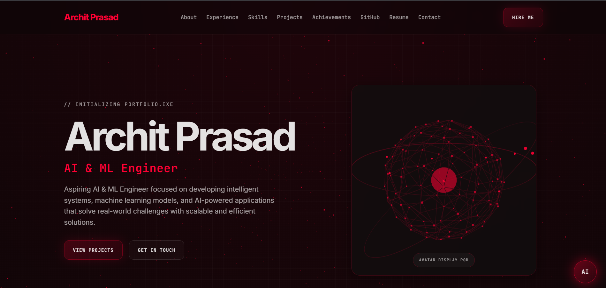

# 🚀 ArchitVerse — AI & ML Engineer Portfolio

<p align="center">

  
  
  
  

</p>

<p align="center">
  <b>My personal AI & ML portfolio featuring an immersive 3D interface and an AI-powered personal assistant.</b>
</p>

<p align="center">

  <a href="https://architverse.vercel.app/">
    🌐 <b>Live Portfolio</b>
  </a>

</p>

---

## 🖥️ Portfolio Preview

<p align="center">
  
</p>

---

## 🤖 About ArchitVerse

**ArchitVerse** is my personal developer portfolio designed to showcase my journey as an **AI & ML Engineer**.

The portfolio combines a modern dark interface, immersive 3D visuals, interactive sections, and an AI-powered chatbot that can answer questions about my skills, projects, education, and experience.

> Built to be more than a portfolio — an interactive representation of my work and capabilities.

---

## ✨ Features

- 🧑‍💻 Personal introduction and professional profile
- 🌌 Immersive 3D interface
- 🤖 AI-powered personal chatbot
- 📚 About Me & Education
- 💼 Experience & Internships
- 🛠️ Interactive Technical Skills
- 🚀 Featured Projects
- 🏆 Academic Achievements
- 🐙 GitHub Activity
- 📄 Resume Download
- 📬 Contact Section
- 📱 Responsive Design
- ⚡ Deployed on Vercel

---

## 🤖 AI Personal Assistant

The portfolio includes an AI assistant powered by **Groq**.

Visitors can ask questions such as:

```text
What are Archit's technical skills?
